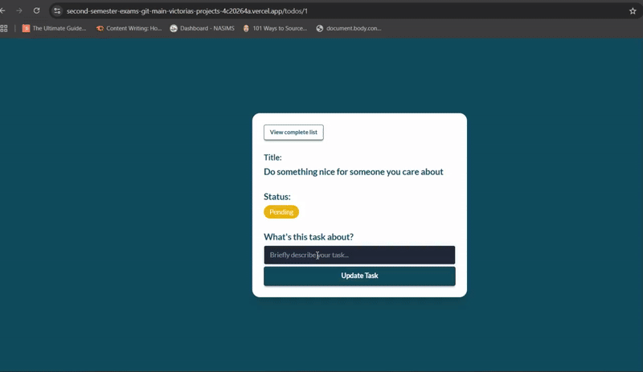

# Second-Semester-Exams
This contains my Second Semester Exam Project for the Tinyuka 2024 Cohort

# Do-It App - A React Todo App with TanStack Query, TailwindCSS & DaisyUI

A sleek, single-page Todo application built with **React**, **TanStack Query**, **TailwindCSS**, and **DaisyUI**. 
DO-It App is a comprehensive task management application that allows users to create, read, update, and delete tasks. The application provides a seamless user experience with features like search functionality, status filtering, pagination, and detailed task views. Built with modern React patterns and best practices, the app demonstrates proficiency in state management, API integration, and responsive design.

---

## Features
Core Functionality

- Task Management: Create, edit, delete, and view tasks
- Task Status Viewing: View tasks as completed or pending
- Search Functionality: Search tasks by title with real-time filtering
- Status Filtering: Filter tasks by completion status (All, Completed, Pending)
- Pagination: Navigate through tasks with pagination controls
- Task Details: View detailed information about individual tasks
- Responsive Design: Works seamlessly across desktop and mobile devices

---

## User Experience

- Dynamic Greetings: Time-based greetings (Good Morning, Afternoon, Evening)
- Interactive UI: Hover effects, smooth transitions, and visual feedback
- Intuitive Navigation: Clear navigation between different views
- Loading States: Visual indicators during data fetching
- Confirmation Dialogs: User confirmation for destructive actions

## Error Handling

- Error Boundaries: Catch and handle React component errors gracefully
- 404 Page: Custom not found page with engaging messaging
- Error Testing: Dedicated test error component for development
- User-Friendly Messages: Clear, helpful error messages throughout the app

---

## Built With
### Frontend Framework

- React 18: Modern React with hooks and functional components
- React Router DOM: Client-side routing for navigation
- React Query (TanStack Query): Server state management and caching

### Styling

- Tailwind CSS: Utility-first CSS framework for styling
- DaisyUI: Component library built on Tailwind CSS
- Custom CSS: Additional styling for specific design requirements

### Icons and UI

- Lucide React: Modern icon library for consistent iconography

### API

- DummyJSON API: External API for todo data operations
- Fetch API: Native browser API for HTTP requests

## Resource links
- [React](https://reactjs.org/)
- [TanStack Query](https://tanstack.com/query/latest)
- [Tailwind CSS](https://tailwindcss.com/)
- [DaisyUI](https://daisyui.com/)
- [Lucide Icons](https://lucide.dev/)

---

## Getting Started

### Prerequisites

- Node.js (version 14 or higher)
- npm or yarn package manager
- Modern web browser

### Steps
1.  Clone the Repository
```sh
git clone https://github.com/nohgu21/second-semester-exams.git
cd react-todo-tanstack
```
2. Install Dependencies
```sh
npm install
```
3. Start the Development Server
```sh
npm run dev
```
---

# API Reference
This app uses the DummyJSON Todos API:
- GET /todos
- POST /todos
- PUT /todos/:id
- DELETE /todos/:id

---

# Component Architecture

## Core Components

### App.jsx

- Main application component
- Router configuration
- Error boundary integration
- Route definitions

### Greeting.jsx

- Dynamic time-based greetings
- Uses React hooks for state management
- Automatically updates based on current time

see here: 

---

### TodoList.jsx

- Displays paginated list of todos
- Handles search and filter logic
- Manages edit and delete operations
- Implements pagination controls


### TodoDetails.jsx

- Shows detailed view of individual todos
- Allows adding descriptions to pending tasks
- Handles task status display
- Provides navigation back to main list

see here: 

---

### SearchFilter.jsx

- Provides search input functionality
- Offers status filtering options
- Uses controlled components pattern
- Responsive design for mobile and desktop

### AddTodoModal.jsx

- Modal for creating new todos
- Form validation and submission
- Integration with React Query mutations
- Accessible modal implementation

---

### EditTodoModal.jsx

- Modal for editing existing todos
- Pre-populated with current task data
- Update functionality with API integration
- User-friendly interface

### ErrorBoundary.jsx

- Catches and handles React errors
- Provides fallback UI for error states
- Logs errors for debugging
- User-friendly error messages

---

# Styling and Design
## Design System

### Color Scheme:

- Primary: #0F4C5C (Deep teal)
- Secondary: #1F2937 (Dark gray)
- Background: #0F4C5C
- Text: White and gray variations


- Typography: Lato font family for clean, readable text
- Spacing: Consistent spacing using Tailwind utilities
- Borders: Rounded corners for modern appearance

---

### Responsive Design

- Mobile-First: Designed for mobile devices first
- Flexible Layouts: Uses CSS Grid and Flexbox
- Breakpoints: Responsive design for different screen sizes
- Touch-Friendly: Appropriate button sizes for mobile interaction

### Interactive Elements

- Hover Effects
- Loading States
- Focus Management

--- 

## Technical Improvements

- Performance Monitoring: Add performance tracking
- TypeScript: Migrate to TypeScript for better type safety
- SEO Optimization: Improve search engine optimization
- Documentation: Enhanced code documentation

---

# Challenges I Faced Building This Todo App

While building this todo application, I ran into several challenges that taught me valuable lessons about React development. Here are the main issues I encountered and how I worked through them:

1. LocalForage and Data Indexing Issues
I had trouble setting up LocalForage properly and understanding how data indexing works. The data wasn't being stored or retrieved correctly, which made it hard to persist todos between browser sessions. I had to spend time reading the documentation to understand how LocalForage handles different data types and storage methods. In fact, I wasn't sure it was going to work.

2. Using Variables Before Declaration
I kept getting "Cannot access variable before initialization" errors because I was trying to use variables (especially React hooks like useMutation) before they were declared in my code. This happened most often when I tried to reference a mutation in a useEffect that was placed above where the mutation was created.

---

3. Pagination Logic Confusion
I struggled with implementing pagination because I was mixing up page and limit parameters. Even though I was setting these values, my next and previous buttons weren't working. I couldn't figure out why the pagination wasn't moving through the data correctly. It turned out I wasn't properly calculating the total pages or updating the current page state when buttons were clicked.

4. Learning useMutation
useMutation from React Query was completely new to me. I didn't understand how to properly use it for creating, updating, and deleting todos. I had to learn about mutation functions, how to handle loading states, success callbacks, and error handling. The concept of optimistic updates was also very confusing at first.

---

5. Inline Styling with Tailwind CSS
Since I was used to writing regular CSS, switching to Tailwind's utility classes was challenging. I often found myself trying to write custom CSS instead of using Tailwind classes. I had to rely on my knowledge of vanilla CSS properties to figure out styling patterns. I also had to go on dribble for colour todo UI options and selected a colour palette.

6. Component Separation Problems
When I started breaking my code into smaller components, I made mistakes about which parts of the code belonged where. I would copy the wrong pieces of state management or event handlers to the new components, which caused bugs. Learning how to properly pass props and manage state between parent and child components took some time.

---

7. Error Handling
Implementing proper error handling was tricky. I used my basic knowledge of try-catch blocks from regular JavaScript, but I had to learn how React handles errors differently. I needed to understand error boundaries and how to display user-friendly error messages when API calls failed.

8. Confusing Hooks with Props
At several points, I mixed up React hooks with props. I would try to destructure hooks like they were props or vice versa. This caused many "hook is not defined" errors. I had to practice understanding the difference between data coming from parent components (props) and data managed within the component (hooks).

---

9. Incorrect Destructuring
I made many mistakes with destructuring objects and arrays, especially when working with form data and API responses. Sometimes I would destructure properties that didn't exist, or I would destructure them with the wrong names, leading to undefined values.

---

# What Helped Me Overcome These Challenges
Doing this entire project, I realised even though React and JS were different, having a foundation in basic JavaScript was crucial for solving these React-specific problems. Concepts like:
- Variable scoping and hoisting
- Object and array destructuring
- Async/await and promises
- Event handling
- DOM manipulation

---

Thank You!
